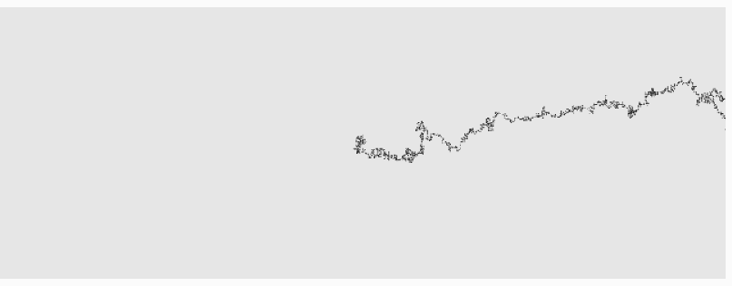

#### Distribución uniforme y no uniforme de aleatorios:

La distribución uniforme se ve en el ejemplo cuando se utiliza random(), esta función genera un número aleatorio entre dos números, todos los números entre estos tienen la misma probabilidad de salir, por eso se llama uniforme.

La distribución no uniforme es la que tiene diferentes probabilidades entre los números que limitan los resultados, en el caso del ejemplo es una distribución normal, cuando se escoge un número aleatorio en esta, los que más tienden a salir son los que estan cerca de la media del intervalo, es decir entre más cercanos a la mitad entre estos dos números, más sale.


#### Modificación al codigo:

Despues de ver el ejemplo supuse que se podria usar randomGaussian() en vez de random() para que el trazo tienda a ir más hacia la derecha, haciendo que la derecha sea un número muy cercano a ka media y la izquierda el número más alejado de esta; esta fue la modificación que realice:

``` js
    step() {
    const choice = floor(randomGaussian(0, 2));    // Cambie el tipo de distribución de uniforme a gaussiana y puse la media como 0, con desviación estandar de 2
    if (choice == 1) {                             // Hice que el trazar a la derecha ocurriera siempre que sale 1, que es cercano a 0, por lo que tiene una probabilidad más alta de salir
      this.x++;
    } else if (choice == 2) {                      // Hice que trazar a la izquierda correspondiera a 2, lo que lo hace más dificil de salir
      this.x--;
    } else if (choice == -1) {
      this.y++;
    } else if (choice == 0){
      this.y--;
    }
  }
```

Sumado a los cambios que hice la actividad pasada el resultado fue este:



El codigo completo hasta este momento se ve asi:

``` js

  let walker;


function setup() {
  createCanvas(640, 240);
  walker = new Walker();
  background(230);
}

function draw() {
  walker.intensity();
  walker.step();
  walker.show();
}

class Walker {
  constructor() {
    this.x = width / 2;
    this.y = height / 2;
    this.k = 0;
  }

  show() {
    stroke(this.k);
    point(this.x, this.y);
  }

  step() {
    const choice = floor(randomGaussian(0, 2));
    console.log("choice=", choice);
    if (choice == 1) {
      this.x++;
    } else if (choice == 2) {
      this.x--;
    } else if (choice == -1) {
      this.y++;
    } else if (choice == 0){
      this.y--;
    }
  }
  intensity(){
  const intense = floor(random(255));
  this.k = intense;
  }

}

```
