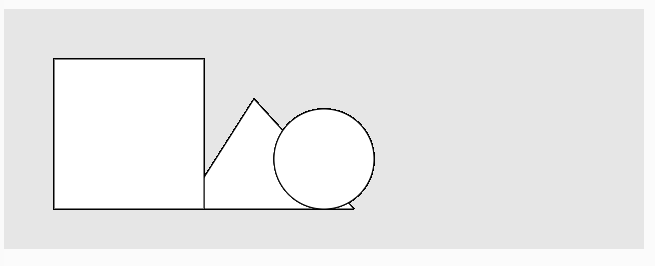
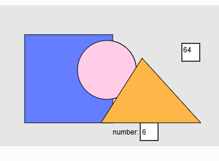
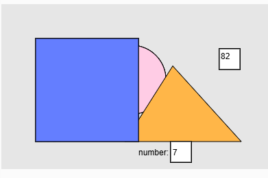

Distribución Normal

Enunciado: implementa un ejemplo que genere números aleatorios con una distribución normal (gaussiana). Visualiza la distribución utilizando figuras geométricas.

Entrega:

    Código del ejemplo
    Captura de pantalla
    Una breve explicación de cómo se refleja la distribución normal en la visualización.


#### Visualización de la distribución Gaussiana con figuras geometricas

Intentare crear un codigo que muestre una diferente figura dependiendo del número que salga de un randomGaussian()

Mi experimento inicial sera con media 5 y desviación estandar 3, si el número es 4, 5 o 6, se creara un triangulo naranja, si es un número menor a 4 sera un cuadrado azul y si es mayor que 4 sera un circulo rosa

Este fue mi primer intento:




Si bien tecnicamente funciona, no se puede distinguir mucho los resultados ni que tan frecuentes son, por lo que intentare poner un contador para que sea cada 10 segundos, tambien agregare los colores:



En esta imagen se puede ver que el ultimo número en salir fue 6, que es cercano a 5 y corresponde al triangulo naranja, que esta al frente



En esta, que ocurrio 20 segundos despues, puede verse que el ultimo número en salir fue 7, que esta más alejado del 5 y corresponde al cuadrado azul, que ahora esta al frente

``` js
let timer = 1


function setup() {
  createCanvas(640, 240);
  background(230);
  text("number:", 200, 220);
}

function draw() {
  fill(255);
  square(318, 65, 30);  
  fill(0);
  text(timer, width/2, 80);
  if (frameCount % 60 == 0 && timer > 0)
    {
      timer++;
    }
  if (frameCount % 600 == 0 && timer > 0) {
    const choice = floor(randomGaussian(5, 3)); 
    fill(255);
    square(247, 200, 30);
    fill(0);
    text(choice, 250, 220);
  console.log("choice=", choice);
    if (choice < 4) {
      fill(color(255, 204, 229));
      circle(190, 110, 100);
    } else if (choice > 6) {
      fill(color(100, 126, 255));
      square(50, 50, 150);
    } else 
      {
        fill(color(255, 182, 72));
      triangle(350, 200, 180, 200, 250, 90);
      }
    
  }
  
 
}


```


Mi idea era que se viera más adelante la figura que correspondiera a un intervalo de números cercano o alejado a la media

Considero que podria mejorarse para que se vea la cantidad de veces que ha aparecido uno de estos, es decir, que se vea que hay varios triangulos o circulos en vez de solo el ultimo en salir, pero para esto tendria que implementar más contadores.
