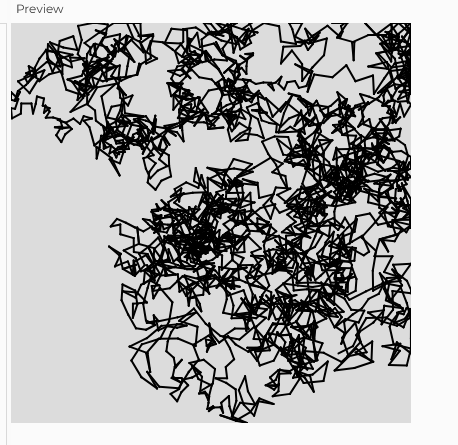

Distribución personalizada: Lévy flight

Enunciado: realiza una simulación donde visualices un salta de Lévy.

Entrega:

    En qué consiste el concepto de Lévy flight y en qué caso sería interesante usarlo.
    Código de la simulación.
    Captura de pantalla.

#### Salto de Lévy

El concepto de vuelo de Lévy o Lévy flight se refiere a un tipo de paseo aleatorio, en ingles random walk, que segun [matematicos de la universidad de Tokyo](https://www.lavanguardia.com/vida/20190412/461599421658/vuelo-levy-patron-matematico-peaton-paso-cebra.html), describe el como multidudes humanas se mueven en patrones colectivos que dependen de como crean o ven que la gente a su alrededor se movera, este fenomeno se ve en la naturaleza y se usa para metodos estocasticos.

Puede ser interesante usarlo dentro de la carrera en simulaciones de multitudes que se mueven, que principalmente se usaria en la rama de vidojuegos pero podria ser usada en animación o experiencias.


Encontre este codigo para p5 para una simulación del vuelo de Levy, [le pertenece a Batool Al Tameemi](https://editor.p5js.org/BatoolAlTameemi/sketches/H43Z8Qz9p):

``` js
let position;
let stepSize;

function setup() {
  // Create a canvas
  createCanvas(400, 400);
  background(220);

  // Initialize the starting position within the canvas boundaries
  position = createVector(random(width), random(height));

  // Initialize the initial step size within a range to control speed
  stepSize = random(5, 20); // Adjust this range for different speeds
}

function draw() {
  // Draw a point at the current position
  stroke(0);
  strokeWeight(2);
  point(position.x, position.y);

  // Levy Flight: Generate a random angle and magnitude for the step
  let angle = random(TWO_PI); // Random angle between 0 and 2*PI
  let magnitude = random(1, 100); // Random magnitude for the step

  // Calculate the new position based on the step's direction and magnitude
  let newPosition = createVector(
    position.x + cos(angle) * stepSize,
    position.y + sin(angle) * stepSize
  );

  // Constrain the new position to stay within the canvas boundaries
  newPosition.x = constrain(newPosition.x, 0, width);
  newPosition.y = constrain(newPosition.y, 0, height);

  // Draw a line from the current position to the new position
  line(position.x, position.y, newPosition.x, newPosition.y);

  // Update the position to the new position
  position = newPosition;

  // Occasionally change the step size with a probability of 10%
  if (random(1) < 0.1) {
    stepSize = random(5, 20); // Change step size to a new random value for variation
  }
}

```


