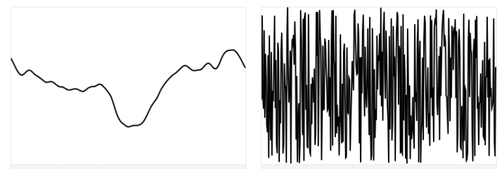

Ruido Perlin

Enunciado: utiliza el ruido Perlin para generar variaciones aleatorias pero suaves. Construye una aplicación que permita visualizar lo anterior.

Entrega:

    Explica en tus propias palabras la figura 0.4: "A graph of Perlin noise values over time (left) and of random noise values over time (right)"
    Explica cómo usaste el ruido Perlin para generar las variaciones.
    El código.
    Una captura de pantalla que muestre la visualización generada.


#### Ruido Perlin:

El ruido perlin (el cual se ve en la grafica a la izquierda) es un tipo de ruido que genera números "al azar", busca que los números transicionen entre ellos de forma suave, a diferencia del random que funciona con uniforme que pasa entre números que no tienen ninguna relación o cercania, y entonces se ve más "caotica" cuadno se grafica:



Para poner en practica el ruido Perlin intente implementar partes del ejemplo del texto guia y mezclarlas con el codigo que hice anteriormente para mostrar la cosa Gaussiana, se ve asi:


Un circulo rosa se genera cada segundo, se puede evidenciar el ruido Perlin en el patron en el que aparecen a lo largo del ancho del canvas, para contrastar, agregue un elemento de cosa uniforme en la posición vertical, se puede evidenciar que entre los circulos generados hay mucho espación entre varios grupos de circulos en sus posiciones verticales, pero se ven más conectados en la posición horizontal, donde use el ruido Perlin.

Este es el codigo que cree:

``` js

let t = 0;

let h = 180;

let timer = 1


function setup() {
  createCanvas(640, 240);
  background(230);
}

function draw() {
  if (frameCount % 60 == 0 && timer > 0)
    {
      let n = noise(t);
  //{!1} Use map() to customize the range of Perlin noise.
  let x = map(n, 0, 1, 0, width);
  fill(color(255, 204, 229));
  circle(x, h, 25);
  //{!1} Move forward in time.
  t += 0.005;
  h=random(height)
      timer++;
    }  
}
```
