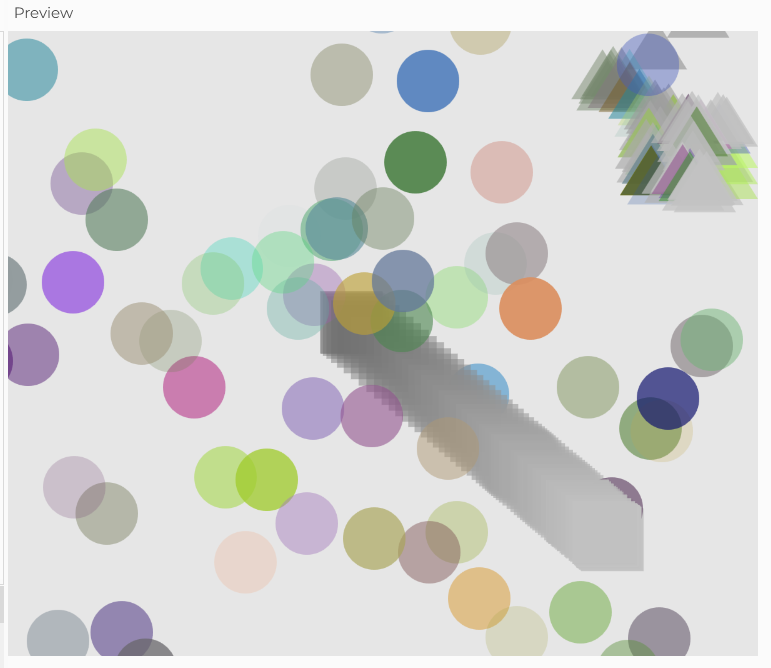

#### Aplicación implementada:

Codigo de la aplicación:

``` js
let button;
let whatShape;
let x;
let y;
let whatColor1 = 255;
let whatColor2 = 204;
let whatColor3 = 229;
let trans = 200;
let t = 0;
let h = 180;
let position;
let stepSize;


function setup() {
  button =createCanvas(600, 500);  
  background(230);
  button.mouseClicked(choice);
  position = createVector(random(width-50), random(height+40));
  
  stepSize = random(20, 50);
}


function choice()  // el mismo canvas sera el que represente la distribución uniforme
{
  
  whatShape = floor(random(3));
  console.log(whatShape);
  shapes();
  
}

function shapes()
{
  
  fill(color(255, 204, 229));
  noStroke();
  if (whatShape == 0)  // circulo correspondera a gaussiana
    {
      whatColor1 = floor(randomGaussian(128, 50));
      whatColor2 = floor(randomGaussian(128, 50));
      whatColor3 = floor(randomGaussian(128, 50));
      trans = floor(randomGaussian(128, 50));
      fill (whatColor1, whatColor2, whatColor3, trans);
      x = floor(randomGaussian(((width-50)/2), ((width/2)-50)));
      y = floor(randomGaussian(((height+50)/2), ((height/2)-50)));          //usando la distribución gaussiana se busca el color, la ubicación y la transpariencia
      circle(x, y, 50);
    }
  else if(whatShape == 1) //cuadrado correspondera a 
    {
      let n = noise(t);
      x = map(n, 0, 1, 0, width);
      whatColor1 =map(n, 0, 1, 0, 256);
      whatColor2 =map(n, 0, 1, 0, 256);
      whatColor3 = map(n, 0, 1, 0, 256);    
      trans = map(n, 0, 1, 0, 256);
      fill (whatColor1, whatColor2, whatColor3, trans)
      y = map(n, 0, 1, 0, height);
      square(x, y, 50);
      t += 0.01;
    }
  else  //intentare usar el paso de levy pero no estoy muy segura de que sirva o se pueda evidenciar bien
    {
      x = position.x;
      y = position.y;
      fill (whatColor1, whatColor2, whatColor3, trans)
      triangle(x, y, (x+50), y, (x+25), (y-40));  
      
      let angle = random(TWO_PI); 
  let magnitude = random(1, 100); 

  let newPosition = createVector(
    position.x + cos(angle) * stepSize,
    position.y + sin(angle) * stepSize
  );
      whatColor1=(floor(whatColor1 + cos(angle) * stepSize));
      whatColor2=(floor(whatColor2 + cos(angle) * stepSize));
      whatColor3=(floor(whatColor3 + cos(angle) * stepSize));
      trans=(floor(trans + cos(angle) * stepSize));


      newPosition.x = constrain(newPosition.x, 0, (width-50));
      newPosition.y = constrain(newPosition.y, 0, (height+40));

 
      line(position.x, position.y, newPosition.x, newPosition.y);

      position = newPosition;
          
      
      if (random(1) < 0.1) {
    stepSize = random(5, 20); 
  }
    }
      
  
}
```

Este fue el resultado visual:




Cambios en el plan:

No esta totalmente claro en lo que escribi en la actividad pasada pero mi intención era que al hacer click en el canvas las figuras que salieran fueran saliendo constantemente, pero no fui capaz de implementar esto, por lo que solo aparece una figura por cada click.

Tambien evidencie más conceptos de los que esperaba usar, inicialmente solo pense usar la distribución uniforme, gaussiana y el ruido Perlin, pero si termine utilizando el salto de levy tambien.
