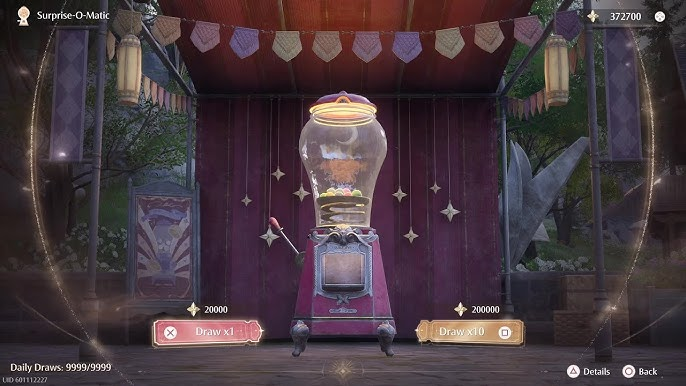

#### Conceptos vistos aplicados en IDED:

Lo primero en lo que pienso para poner en practica estos conceptos en mi carrera es en la creación de simulaciones, considero que podria funcionar en cualquier rama, se podria usar en tiempo real especificamente en experiencias interactivas o videojuegos; digamos que existe un juego de realidad virtual en el cuals e camina en medio de una ciudad en cierto punto, el salto de Levy funciona para este caso, donde los npc que caminan al rededor del usuario predicen cual seria el mejor paso siguiente para no chocar con el u otro npc.

El ruido de Perlin se puede utilizar en un shader o geometry node para crear patrones "aleatorios" que cumplan con cierta uniformidad y ritmo, se me ocurre un vestido con estrellas o brillos que iran apareciendo y desapareciendo, en una animación 3D, o en un personaje para jugar, como algunos en el juego infinity nikki.

Finalmente la distribución gaussiana, croe que podria reflejarse en mecanicas tipo "ruleta de la suerte" donde en realidad se tiende a ganar más unas cosas que otras, como en el juego anteriormente mencionado, donde existe una maquina gachapon donde se puede conseguir ropa de 3 a 5 estrellas.

Tambien, y quiza incluso más facil de implementar en minijuegos como pesca, donde lo usual seria conseguir peces con poco peso, asumiento que estos son los que se identifican en la media de la distribución, y en ocasiones con suerte se saca un pez "gordo", que corresponderia a valores más alejados de la media, incluso podria subirse el valor de la desviación estandar cuando se sube de nivel, subiendo la posibilidad de conseguir peces más gordos, que resultan en más recursos.
