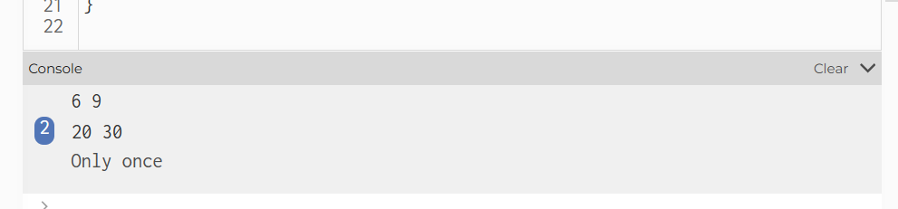

#### Imprimir los vectores por valor y referencia:

En esta actividad estoy asumiendo que se me pide que ponga en la consola el vector, por lo que intentare poner ahi el vector desde el inicio, y el vector despues de pasar por la función playingVector, para esto agrego console.log(posicion.x, posicion.y) en tres momentos diferentes: uno antes de la función playingVector, uno despues de las lineas de esta, y uno en la función draw.

Aqui esta mi resultado:





Se puede ver que antes de la función aparecen los valores que se declaran en setup, pero despues en ambas ocasiones aparecen los valores declarados en playingVector


Paso por valor y paso por referencia se refieren a las funciones que afectan una variable solo dentro de una función, donde se crea una copia de la variable, o si la afecta a la variable globalmente, y entonces en vez de crear una copia, la cambia directamente.

Intente combinar unos ejemplos que vi en [esta pagina](https://docs.hektorprofe.net/python/programacion-de-funciones/paso-por-valor-y-referencia/) con el lenguaje javascript, pero cuando intentaba imitar el codigo en p5, parecia que ambos eran por referencia, intente investigar directamente paso de valor en java script y en [esta otra pagina](https://medium.com/@lupomontero/por-valor-vs-por-referencia-en-javascript-de3daf53a8b9) lei que en realidad no es posible realizar paso por referencia en js, al menos no con valores primitivos, se hace paso de referencia cuando se asignan valores complejos.

finalmente encontre estos ejemplos en esa ultima pagina:

``` js
let a = 'hola';
let b = a; // asignamos valor de `a` a `b`.a += '!'; // cambiamos valor de `a` añadiendo ! al final
console.log(a); // hola!
console.log(b); // hola
```
Este es el paso por valor

``` js
const a = [1, 2, 3];
const b = a;a.push(4);
console.log(a); // [ 1, 2, 3, 4 ]
console.log(b); // [ 1, 2, 3, 4 ]
```
Este es el paso por referencia


el ejemplo que se ve en la actividad, es paso por referencia


Por lo que entiendo, en js, cuando se hacen funciones con vectores u arreglos se hacen pasos por referencia,
