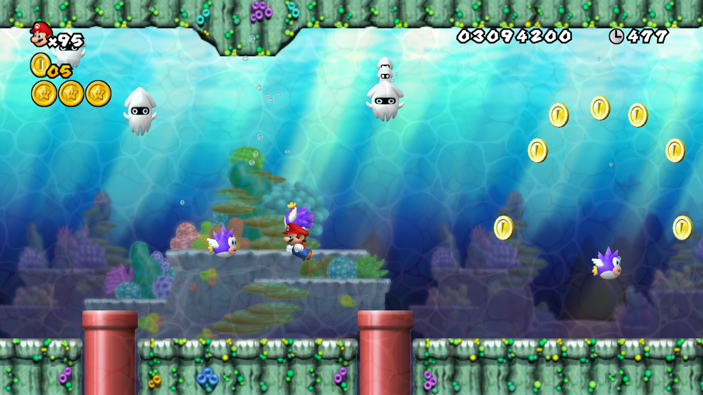

#### Idea aplicación:

En la forma más superficial, quiero hacer una bolita que siga el mouse, y que su aceleracion respecto a la velocidad vaya variando, y cuando llegue hasta ciertos topes cambie de color

De una forma mejor explicada quiero hacer un pecesito, que persiga una carnada y que cuando se esfuerce mucho(vaya más veloz) se pondra rojo, cuando se canse se pondra verde, y cuando este nadando con "velocidad normal" sera azul, lo que ahora mismo me preocupa un poco es poder hacer al pecesito, pero creo que poniendo las coordenadas de un triangulo dependiendo de un circulo, puede hacerse, solo que probablemnte se vea raro cuando vaya en diagonal, no se si pueda arreglar eso.

Referente:

Pense mucho en los pecesitos de los juegos de Mario, que mientras estan en pantalla te persiguen y visualmente se parece mucho a los movimientos que hace la oblita en el ejemplo de aceleracion por mouse en el texto guia

La forma en la que planeo ponerlo en practica es creando un fondo azul, quiza burbujas, y un mover, que sera el que decide las posiciones del pez, el pez sera un circulo con un triangulo pegado, quiza ocn un circulo mas pequeño para darle ojo, seguira el mouse 

para cambiar la apariencia del cursor:

https://p5js.org/reference/p5/cursor/
