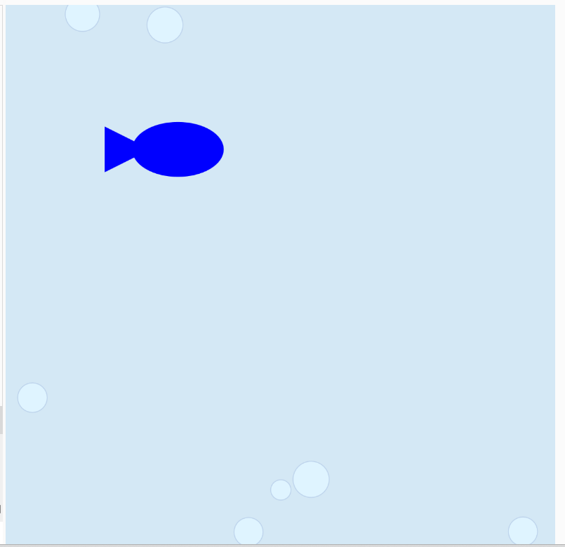
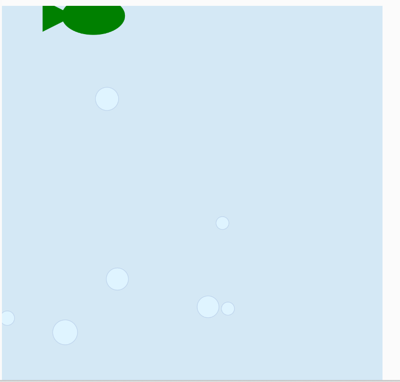

#### Aplicación Unidad 2:

Este fue el codigo que cree para la aplicación:

``` js

let x;
let y;
let mover;
let bubbleA;
let bubbleB;
let bubbleC;
let bubbleD;
let bubbleE;
let bubbleF;
let bubbleG;


function setup() {
  createCanvas(600, 600);  
  mover = new Mover();
  bubbleA = createVector(random(580), random(580), random(20, 40));
  bubbleB = createVector(random(580), random(580), random(20, 40));
  bubbleC = createVector(random(580), random(580), random(20, 40));
  bubbleD = createVector(random(580), random(580), random(20, 40));
  bubbleE = createVector(random(580), random(580), random(20, 40));
  bubbleF = createVector(random(580), random(580), random(20, 40));
  bubbleG = createVector(random(580), random(580), random(20, 40));
}

function mousePressed()
{
  mover.acceleration *=-1;
  
  console.log("click presse");
}

function draw() {  
  let v0 = createVector(mouseX, 0);
  let timeMouse=(mouseX, mouseY);
    background(212, 232, 245);
  cursor('baitClick.png', 16, 16);
  stroke(190, 212, 236);
  fill(223, 244, 255);
  circle(bubbleA.x, bubbleA.y, bubbleA.z);
  circle(bubbleB.x, bubbleB.y, bubbleB.z);
  circle(bubbleC.x, bubbleC.y, bubbleC.z);
  circle(bubbleD.x, bubbleD.y, bubbleD.z);
  circle(bubbleE.x, bubbleE.y, bubbleE.z);
  circle(bubbleF.x, bubbleF.y, bubbleF.z);
  circle(bubbleG.x, bubbleG.y, bubbleG.z);

    mover.update();
  mover.checkEdges();
  mover.show();
  
  x=floor(random(600));
  y=floor(random(600));
  noStroke();
  fill(67, 20, 223);
  //ellipse(200, 250, 100, 60);
  //triangle(120, 225,120, 275, 170, 250);  
  
  //ellipse(x, y, 100, 60);
  //triangle(x-80, y-25,x-80, y+25, x-30, y);  
  console.log(mover.velocity.x, " y ", mover.velocity.y);
}

class Mover {

  constructor() {

    this.position = createVector(width / 2, height / 2);

    this.velocity = createVector(0, 0);

    this.acceleration = createVector(-0.001, 0.01);


    this.topSpeed = 25;


  }

  update() {
    let mouse = createVector(mouseX, mouseY);
    // Step 1: Compute the direction.
    let dir = p5.Vector.sub(mouse, this.position);
    // Step 2: Normalize.
    dir.normalize();
    // Step 3: Scale.
    dir.mult(0.2);
    //{!1} Step 4: Accelerate.
    this.acceleration = dir;
    this.velocity.add(this.acceleration);
    this.velocity.limit(this.topSpeed);
    this.position.add(this.velocity);
  }


  show() {
    let x = map(mover.velocity.x, 0, 1, 0, 1);
    noStroke();
    fill(lerpColor('blue','green', x));
    x=this.position.x;
    y=this.position.y;
    ellipse(this.position.x, this.position.y, 100, 60);
  triangle(this.position.x-80, this.position.y-25,this.position.x-80, this.position.y+25, this.position.x-30, this.position.y); 
  }

  checkEdges() {
    if (this.position.x > width) {
      this.position.x = 0;
    } else if (this.position.x < 0) {
      this.position.x = width;
    }

    if (this.position.y > height) {
      this.position.y = 0;
    } else if (this.position.y < 0) {
      this.position.y = height;
    }
  }
}
```

Estos son algunas capturas de como se ve:






Cambios:

Inicialmente pense en quiza ponerle ojo al pecesito pero finalmente decidi no hacerlo, tambien habia propuesto que tendria tre colores pero con lerp no logre eso, solo dos, tambien los habia establecido como que seria azul normalmente y verde cuando va muy rapido, pero la forma en la que lo implemente realmente fue que es azul cuando se dirige a un lado y verde cuando se dirige al otro, ya que cuando la velocidad es muyy baja en realidad esta yendo rapido a un lado.
