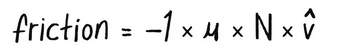
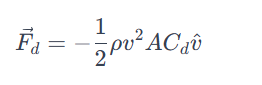
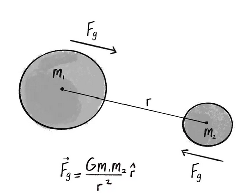

#### Simulacion con modelo de fuerzas:

A continuacion se explicara como se modelaron 3 fuerzas y se aplico en el codigo:

Fricción:


``` js

let mover;

function setup() {
  createCanvas(640, 240);
  mover = new Mover(width / 2, 30, 3);  //aqui se especifica en que luagr del eje x, y aparecera el mover, y la masa de este.
}


function draw() {
  background(255);

  let gravity = createVector(0, 1);
  mover.applyForce(gravity);
  if (mouseIsPressed) {
    let wind = createVector(0.5, 0);
    mover.applyForce(wind);
  }

  if (mover.contactEdge()) {
    let c = 0.1;
    let friction = mover.velocity.copy();  //aqui se adapta la ecuacion de friccion, empezando por multiplicar el vector de velocidad por -1
    friction.mult(-1); // aqui se realizo la multiplicacion emncionada arriba
    friction.setMag(c); // aqui se establece la magnitud, en la ecuacion original esto se da multiplicando el coeficiente de friccion con la fuerza normal, aqui asumimos que la normal es 1, por lo que la magnitud simplemente es el coeficiente de friccion c.
    // Apply the friction force vector to the object.
    mover.applyForce(friction); //aqui se aplica friccion en apply force
  }

  mover.bounceEdges();
  mover.update();
  mover.show();

}


class Mover {
    constructor(x, y, m) {
    this.mass = m;
    this.radius = m * 8;
    this.position = createVector(x, y);
    this.velocity = createVector(0, 0);
    this.acceleration = createVector(0, 0);
  }     //parte del constructor se cambio para ser mas similar al del texto guia, de esto tambien dependen algunas partes de la clase mover, anteriormente no tenia radio

  applyForce(force) {
    let f = p5.Vector.div(force, this.mass);  //ya no tiene una masa igual siempre, se puede escoger la masa desde que se crea el mover fuera de la clase
    this.acceleration.add(f);
  }

update() {
  this.velocity.add(this.acceleration);
  this.position.add(this.velocity);
  this.acceleration.mult(0);
}

  show() {
    stroke(0);
    strokeWeight(2);
    fill(127, 127);
    circle(this.position.x, this.position.y, this.radius * 2);
  }

  contactEdge() {
  return (this.position.y > height - this.radius - 1);
}


  bounceEdges() {
  let bounce = -0.9;
  if (this.position.y > height - this.radius) {
    this.position.y = height - this.radius;
    this.velocity.y *= bounce;
  }
}
  
}
```

[Codigo Fricción](https://editor.p5js.org/Mafe-Garcia/sketches/zLqMYo8X5)

¿Como se modelo?

Para esta primera fuerza consulte mucho el texto guia, sin perder de vista los pasos, primero se busca la ecuación de esta fuerza:



Despues se revisa si hay vectores, que en efecto hay, el de velocidad, como la friccion va en la direccion opuesta a la fuerza normal, se ve en el -1, para el codigo entonces, tenemos que sacar una copia del valor de velocidad, y despues lo multiplicamos por -1


Se revisa que más ocurre en la ecuación, falta buscar la magnitud, esta en la ecuación se busca multiplicando mu, el coeficiente de friccion, por la fuerza normal, siguiendo el texto guia, y porque yo tampoco quiero enredarme más, se asume que la normal sera siempre 1 y el coeficiente se deja en 0.1, se podria declarar la normal y el coeficiente y luego multiplicarlos, pero sabiendo que SIEMPRE sera 1, es emjor simplemente poner que la magnitud es igual al coeficiente


Finalemnte se lleva esta fuerza al applyForce


Resistencia del Aire y Fluidos:

``` js

let mover;

function setup() {
  createCanvas(640, 240);
  mover = new Mover(width / 2, 20, 4);  //aqui se especifica en que luagr del eje x, y aparecera el mover, y la masa de este.
  liquid = new Liquid(0, height / 2, width, height / 2, 0.1); //aqui se declara el objeto liquido, los primeros 4 valores son para crear el rectangulo que lo representa, y el quinto es para expresar el coeficiente de resistencia
}


function draw() {
  background(255);

liquid.show();

  
    if (liquid.contains(mover)) {                      // se fija si el mover ya toco el liquido
      let dragForce = liquid.calculateDrag(mover); //si si, entonces busca calcular la resitencia al objeto
      mover.applyForce(dragForce);}  // finalemnte la aplica
    

    let gravity = createVector(0, 0.1 * mover.mass);   //aplica la gravedad, escalando dependiendo de la masa del objeto
    mover.applyForce(gravity);
    mover.update();
    mover.show();
    mover.checkEdges();
  

}


class Mover {
    constructor(x, y, m) {
    this.mass = m;
    this.radius = m * 8;
    this.position = createVector(x, y);
    this.velocity = createVector(0, 0);
    this.acceleration = createVector(0, 0);
  }     //parte del constructor se cambio para ser mas similar al del texto guia, de esto tambien dependen algunas partes de la clase mover, anteriormente no tenia radio

  applyForce(force) {
    let f = p5.Vector.div(force, this.mass);  //ya no tiene una masa igual siempre, se puede escoger la masa desde que se crea el mover fuera de la clase
    this.acceleration.add(f);
  }
  
    checkEdges() {
    if (this.position.x > width) {
      this.position.x = 0;
    } else if (this.position.x < 0) {
      this.position.x = width;
    }

    if (this.position.y > height) {
      this.position.y = 0;
    } else if (this.position.y < 0) {
      this.position.y = height;
    }
  }
  

update() {
  this.velocity.add(this.acceleration);
  this.position.add(this.velocity);
  this.acceleration.mult(0);
}

  show() {
    stroke(0);
    strokeWeight(2);
    fill(127, 127);
    circle(this.position.x, this.position.y, this.radius * 2);
  }

  contactEdge() {
  return (this.position.y > height - this.radius - 1);
}


  bounceEdges() {
  let bounce = -0.9;
  if (this.position.y > height - this.radius) {
    this.position.y = height - this.radius;
    this.velocity.y *= bounce;
  }
}
  
}


class Liquid {     //es la clase del objeto liquido, aqui tambien se calcula la resistencia
  constructor(x, y, w, h, c) {
    this.x = x;
    this.y = y;
    this.w = w;
    this.h = h;
    this.c = c;  // la c es el coeficiente de resistencia
  }
  
  contains(mover) {        // esta parte es la que se fija en si el objeto esta tocando el liquido o no
  let pos = mover.position;
  return (pos.x > this.x && pos.x < this.x + this.w && 
          pos.y > this.y && pos.y < this.y + this.h);
}

  calculateDrag(mover) {  //aqui se calcula la resistencia
  let speed = mover.velocity.mag();  // se calcula la velocidad, que viene del vector de velocidad
  let dragMagnitude = this.c * speed * speed; // se calcula la magnitud, que viene de multiplicar la velocidad por si misma y por el coeficiente de resistencia
  let dragForce = mover.velocity.copy();
  dragForce.mult(-1); // como esta fuerza, igual que la friccion, va en dirección opuesta a la normal, se debe multiplicar por -1
  dragForce.setMag(dragMagnitude);
  return dragForce;
}
  
  show() {
    noStroke();
    fill(175);
    rect(this.x, this.y, this.w, this.h);
  }
}

```


[Codigo Resistencia del Aire y Fluidos](https://editor.p5js.org/Mafe-Garcia/sketches/-mf0xF3Iq)


¿Como se modelo?

Primero se busca la ecuación de esta fuerza:



Se revisa el numero en fracción, 1/2 es lo mismo que 0,5, que es más facil de implementar despues


Despues se revisa si hay vectores, el de velocidad, esta fuerza va en la direccion opuesta a la fuerza normal, se ve en el -, se puede representar con un -1 que se multiplica por todo, para el codigo entonces


Se revisa que más ocurre en la ecuación, falta buscar la magnitud, esta en la ecuación se busca multiplicando el coeficiente de resistemcia, por la velocidad al cuadrado, los otros dos valores que se multiplican en la ecuación se ignoran, asumiendo que el objeto es esferico y que la desidad del liquido es 1.

Finalemnte se lleva esta fuerza al applyForce


Atracción gravitacional:

``` js

let mover;
let attractor;
let G = 1.0;

function setup() {
  createCanvas(640, 360);
  mover = new Mover(300, 100, 5);
  // Initialize the Attractor object.
  attractor = new Attractor();
}

function draw() {
  background(255);

  //{!2} Calculate the attraction force and apply it.
  let force = attractor.attract(mover);
  mover.applyForce(force);
  mover.update();

  attractor.show();
  mover.show();
}


class Mover {
    constructor(x, y, m) {
    this.mass = m;
    this.radius = m * 8;
    this.position = createVector(x, y);
    this.velocity = createVector(0, 0);
    this.acceleration = createVector(0, 0);
  }     //parte del constructor se cambio para ser mas similar al del texto guia, de esto tambien dependen algunas partes de la clase mover, anteriormente no tenia radio

  applyForce(force) {
    let f = p5.Vector.div(force, this.mass);  //ya no tiene una masa igual siempre, se puede escoger la masa desde que se crea el mover fuera de la clase
    this.acceleration.add(f);
  }
  
    checkEdges() {
    if (this.position.x > width) {
      this.position.x = 0;
    } else if (this.position.x < 0) {
      this.position.x = width;
    }

    if (this.position.y > height) {
      this.position.y = 0;
    } else if (this.position.y < 0) {
      this.position.y = height;
    }
  }
  

update() {
  this.velocity.add(this.acceleration);
  this.position.add(this.velocity);
  this.acceleration.mult(0);
}

  show() {
    stroke(0);
    strokeWeight(2);
    fill(127, 127);
    circle(this.position.x, this.position.y, this.radius * 2);
  }

  contactEdge() {
  return (this.position.y > height - this.radius - 1);
}


  bounceEdges() {
  let bounce = -0.9;
  if (this.position.y > height - this.radius) {
    this.position.y = height - this.radius;
    this.velocity.y *= bounce;
  }
}
  
}


class Liquid {     //es la clase del objeto liquido, aqui tambien se calcula la resistencia
  constructor(x, y, w, h, c) {
    this.x = x;
    this.y = y;
    this.w = w;
    this.h = h;
    this.c = c;  // la c es el coeficiente de resistencia
  }
  
  contains(mover) {        // esta parte es la que se fija en si el objeto esta tocando el liquido o no
  let pos = mover.position;
  return (pos.x > this.x && pos.x < this.x + this.w && 
          pos.y > this.y && pos.y < this.y + this.h);
}

  calculateDrag(mover) {  //aqui se calcula la resistencia
  let speed = mover.velocity.mag();  // se calcula la velocidad, que viene del vector de velocidad
  let dragMagnitude = this.c * speed * speed; // se calcula la magnitud, que viene de multiplicar la velocidad por si misma y por el coeficiente de resistencia
  let dragForce = mover.velocity.copy();
  dragForce.mult(-1); // como esta fuerza, igual que la friccion, va en dirección opuesta a la normal, se debe multiplicar por -1
  dragForce.setMag(dragMagnitude);
  return dragForce;
}
  
  show() {
    noStroke();
    fill(175);
    rect(this.x, this.y, this.w, this.h);
  }
}


class Attractor {
  constructor() {
    // The attractor is an object that doesn’t move. It needs just a mass and a position.
    this.position = createVector(width / 2, height / 2);
    this.mass = 20;
  }
  
    attract(mover) {
    //{!1} What’s the force’s direction?
    let force = p5.Vector.sub(this.position, mover.position);
    let distance = force.mag();
    // Calculate the strength of the attraction force.
      
        // Here the constrain() function limits the value of distance between a minimum (5) and maximum (25).
  distance = constrain(distance, 5, 25);
    let strength = (this.mass * mover.mass) / (distance * distance);
    force.setMag(strength);

    // Return the force so it can be applied!
    return force;
  }
  

  show() {
    stroke(0);
    fill(175, 200);
    circle(this.position.x, this.position.y, this.mass * 2);
  }
}

```


[Codigo Atracción Gravitacional](https://editor.p5js.org/Mafe-Garcia/sketches/7yWnHrkG0)


¿Como se modelo?

Primero se busca la ecuación de esta fuerza:


Se analiza la ecuación, ¿como funciona? Se necesita medir la distancia entre dos objetos

Despues se revisa si hay vectores, el de velocidad, esta fuerza va en la direccion opuesta a la fuerza normal, se ve en el -, se puede representar con un -1 que se multiplica por todo, para el codigo entonces

Se revisa que más ocurre en la ecuación, falta buscar la magnitud, esta en la ecuación se busca multiplicando el coeficiente de resistemcia, por la velocidad al cuadrado, los otros dos valores que se multiplican en la ecuación se ignoran, asumiendo que el objeto es esferico y que la densidad del liquido es 1.


Finalmente se lleva esta fuerza al applyForce


