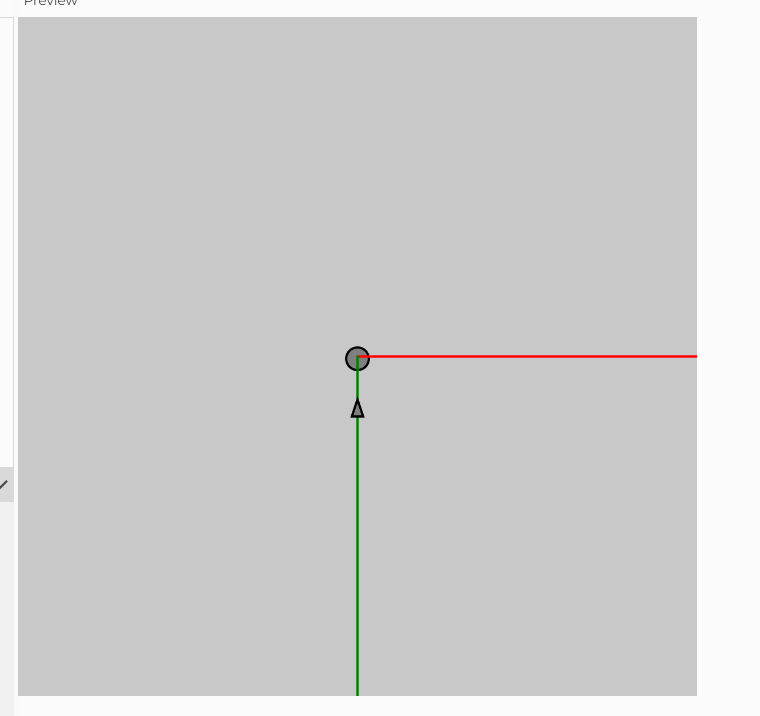
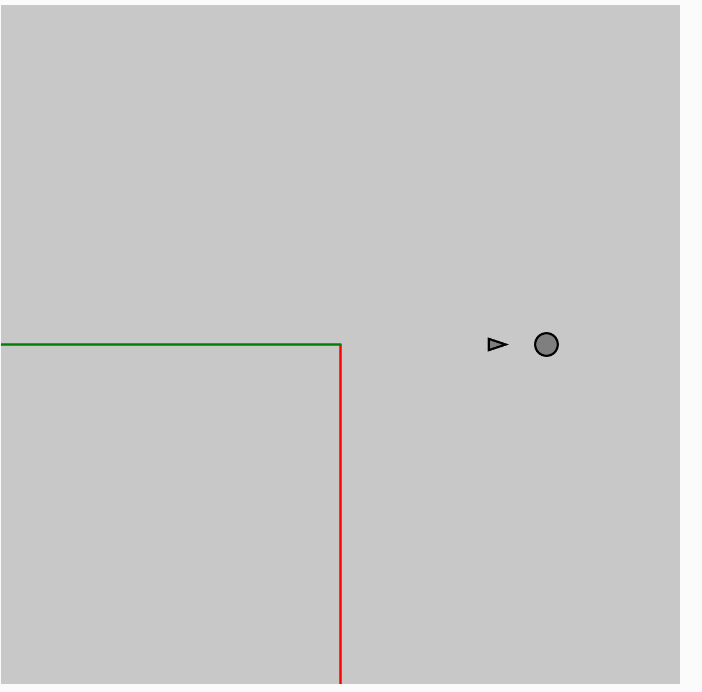

#### Vehiculo que apunta


[Aqui esta el codigo de mi triangulo](https://editor.p5js.org/Mafe-Garcia/sketches/zeR42cV0W)


```
let x = 50;
let y = 50;
let mover;
let followBox;

function setup() {
  createCanvas(600, 600);
  angleMode(DEGREES);
  background(200);
  mover = new Mover();
  
}
let angle = 0;

function draw() {
  background(200);
  
  
  // Update x and y if an arrow key is pressed.
  if (keyIsPressed === true) {
    if (keyCode === UP_ARROW) {
      angle = 0;
    } else if (keyCode === LEFT_ARROW) {
      angle = -90;
    } else if (keyCode === RIGHT_ARROW) {
      angle = 90;
    }
  }
  translate(width / 2, height / 2);
  rotate(angle);
  followBox = createVector(mover.position.x, mover.position.y - 50);
  
  //circle(0,-100, 20);
  circle(followBox.x,followBox.y,20);
  stroke("red");
  line(0,0,width / 2,0);
  stroke("green");
  line(0,0,0,height / 2);
  
  
  mover.update();
  mover.checkEdges();
  mover.display();
}

class Mover {
  constructor() {
    this.position = createVector(0,280);
    this.velocity = createVector(0, 0);
    this.acceleration = 0;
    this.topspeed = 4;
    this.xoff = 1000;
    this.yoff = 0;
    this.r = 16;
  }

  update() {
    let dir = p5.Vector.sub(followBox, this.position);
    dir.normalize();
    dir.mult(0.5);
    this.acceleration = dir;

    this.velocity.add(this.acceleration);
    this.velocity.limit(this.topspeed);
    console.log(`x: ${this.velocity.x}, y: ${this.velocity.y}`);
    
    this.position.add(this.velocity);
    
    this.acceleration = 0;
  }

  display() {
    let angle = this.velocity.heading();

    stroke(0);
    strokeWeight(2);
    fill(127);
    
    push();
    translate(this.position.x,this.position.y);
    
    
       
    triangle( -5,5, 0,-10, 5,5);
    rotate(angle);
    
    pop();
    
    //triangle(width / 2 + 25, height / 2, 160, height / 2, width / 2, 130);
  }

  checkEdges() {
    if (this.position.x > width/2) {
      this.position.x = -width/2;
    } else if (this.position.x < 0) {
      this.position.x = width;
    }

    if (this.position.y > height/2) {
      this.position.y = -height/2;
    } else if (this.position.y < -height/2) {
      this.position.y = height/2;
    }
  }
}


```




