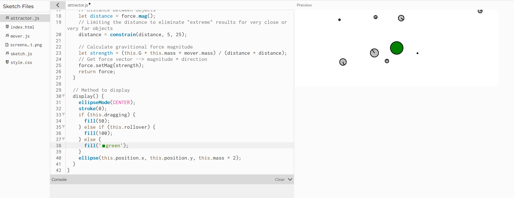

#### Motion 101 con fuerzas:

1. Identifica motion 101
   Se encuentra en el codigo de los mover:
   ``` js
     applyForce(force) {
        let f = p5.Vector.div(force, this.mass);
        this.acceleration.add(f);
      }
    
      update() {
        this.velocity.add(this.acceleration);
        this.position.add(this.velocity);
        this.angleAcceleration = this.acceleration.x / 10.0;
        this.angleVelocity += this.angleAcceleration;
        this.angleVelocity = constrain(this.angleVelocity, -0.1, 0.1);
        this.angle += this.angleVelocity;
        this.acceleration.mult(0);
      }
    
      show() {
        strokeWeight(2);
        stroke(0);
        fill(127, 127);
        rectMode(CENTER);
        push();
        translate(this.position.x, this.position.y);
        rotate(this.angle);
        circle(0, 0, this.radius * 2);
        line(0, 0, this.radius, 0);
        pop();
      }
    }
   ```
En esta parte del codigo los mover aceleran, se determina hacia que punto se movera en la proxima frame y se dibuja el movimiento de la frame actual

2. ¿Qué modificación hay que hacer al motion 101 cuando se queire agregar fuerzas acumulativas?
   Se agrega el add, para ir acumulando cada fuerza, y en el update se finaliza volviendo a poner la aceleración en 0.

3. Identifica donde esta el Attractor de al simulación, cambia su color:
   El attractor se encuentra en su propia pestaña, es una clase, y se refiere al "sol" de este sistema. Yo lo cambie a color verde:

4. El Attractor tiene dos atributos: this.rollover y this.dragging, estos no hacen nada en el codigo actualmente pero permitirian mover el attractor con el mouse y cambiar su color cuando el mouse esta sobre el, ¿Cómo podrias modificar el codigo para que esto funcione?

   Yo cambie el codigo poniendo una funcion mouseClicked fuera de la clase, no hice le dragging como es normalmente si no que mi idea era que cuando se haga click el attractor empieza a seguri el mouse, y cuando haga click de nuevo se queda quieto, dentro de la clase Attractor agregue aceleración y velocidad como atributos, y una update donde ve si se encuentra en estado draggin, rollover o ninguno, tambien le di colores diferentes a los tres estados.

   Aqui esta los cambios:
``` js


class Attractor {
  constructor() {
    this.position = createVector(width / 2, height / 2);
    this.mass = 20;
    this.velocity = createVector(2, 2);
    this.G = 1;
    this.dragging = false;
    this.rollover = false;
  }

  update() {
    let mouse = createVector(mouseX, mouseY);

    
    
    if(this.dragging==true)
      {
        let dir = p5.Vector.sub(mouse, this.position);
    dir.normalize();
    dir.mult(0.5);
    this.acceleration = dir;

    this.velocity.add(this.acceleration);
    this.velocity.limit(this.topspeed);
    this.position.add(this.velocity);
        console.log("true");}
      

    if (
      mouseX >this.position.x - 20 &&
      mouseX < this.position.x + 20 &&
      mouseY > this.position.y - 20 &&
      mouseY < this.position.y + 20
    ) {
      this.rollover = true;
    } else {
      this.rollover = false;
    }
    console.log("x:" + this.position.x);
    console.log(mouseX);
    console.log(mouseY);
  }


  attract(mover) {
    // Calculate direction of force
    let force = p5.Vector.sub(this.position, mover.position);
    // Distance between objects
    let distance = force.mag();
    // Limiting the distance to eliminate "extreme" results for very close or very far objects
    distance = constrain(distance, 5, 25);

    // Calculate gravitional force magnitude
    let strength = (this.G * this.mass * mover.mass) / (distance * distance);
    // Get force vector --> magnitude * direction
    force.setMag(strength);
    return force;
  }

  // Method to display
  display() {
    ellipseMode(CENTER);
    stroke(0);
    if (this.dragging) {
      fill("red");
      let angle = this.velocity.heading();
    } else if (this.rollover) {
      fill("pink");
    } else {
      fill("green");
    }
    ellipse(this.position.x, this.position.y, this.mass * 2);
  }
}


```


[Link al codigo modificado](https://editor.p5js.org/Mafe-Garcia/sketches/WcobfN054)
