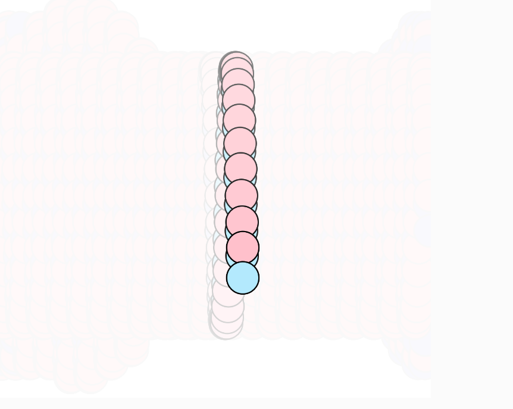
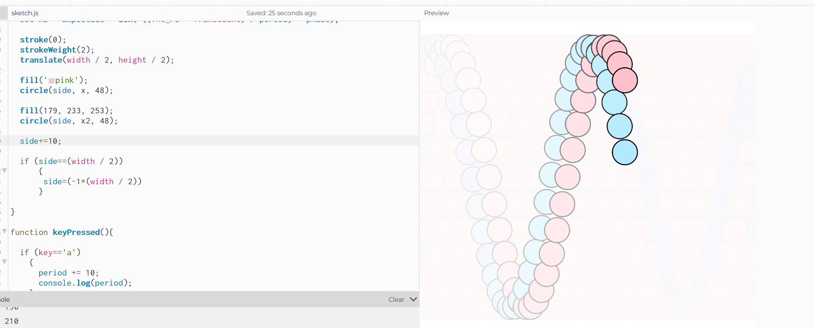

#### Función Sinusoide


Viendo el ejemplo busque que partes del codigo corresponden a cada parte de la función, asi entonces puedo asignar a cada parte una tecla os erie de teclas especificas para cambiarlos

la velocidad angular se puede cambiar cambiando la fecuencia, en este caso cambiando el periodo, de rsto no no se debe cambiar ya que depende del tiempo, que ya esta, y de pi*2, que es constante

La frecuencia no se encuentra directamente, pero sabiendo que periodo=1/frecuencia, lo que se cambiara sera el periodo

la amplitud se encuentra al inicio de la ecuación

la fase describe cuanto deberia moverse horizontalemnte, esta parte no la comprendo totalmente aun

quiero que en mi simulación una o dos bolitas vayan de arriba a abajo dependiendo de estos parametros y se muevan de lado de forma que se vea mejor como cambian

Este fue el codigo que hice:

``` js

let period = 10;
let amplitude = 50;
let phase = 0;

let side =0;

let right = true;

function setup() {
  createCanvas(640, 600);
}

function draw() {
  background(250, 20);
  
  let x = amplitude * sin( ((TWO_PI * frameCount) / period));
  let x2 = amplitude * sin( ((TWO_PI * frameCount) / period) + phase);

  stroke(0);
  strokeWeight(2);
  translate(width / 2, height / 2);

  fill('pink');
  circle(side, x, 48);
  
  fill(179, 233, 253);
  circle(side, x2, 48); 
  
  side++;
  
  if (side==(width / 2))
      {
       side=(-1*(width / 2))
      }
    
}

function keyPressed(){
  
  if (key=='a')
    {
      period += 10; 
      console.log(period);
    }
  else if (key=='d')
    {
      amplitude += 20; 
      console.log(amplitude);
    }
  if (key=='w')
    {
      period -= 10; 
      console.log(period);
    }
  else if (key=='s')
    {
      amplitude -= 20; 
      console.log(amplitude);
    }
  else
    {
      phase += TWO_PI/360;
    }
}
```

[Este es el enlace al editor](https://editor.p5js.org/Mafe-Garcia/sketches/bxX7SACZx)

Aqui esta una captura de como se ve:





Y aqui esta despues de que cambie cuanto se suma en side cada frame, me gusta más:



