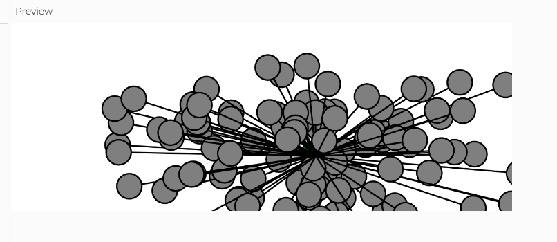

#### Introduciendo unidades anteriores

Para sumarle aleatoriedad y fuerzas a esta unidad, quiero que cada que se haga click o se oprima una tecla uno de los osciladores  de forma aleatoria ahora se vuelva tambien un atractor, creando dinamicas nuevas yn poco raras con los demas, no quiero que sea un problema de n cuerpos, solo quiero un atractor


Pero viendo como esta construida la clase de osciladores, ya tiene aleatoriedad y fuerzas hasta cierto punto


decidi implementar aleatoriedad en la cantidad de osciladores que habra, intente que se creara una nueva cantidads aleatoria entre 0 y 50 cada vez que se hace click, no supe como borrar los anteriores auqnue usara splice, entonces se van sumando más y más

Para usar las fuerzas use un mover que sigue el mouse pero cuando se acerca lo pasa, con los clicks tambien se decide si parara en su lugar pos eguira moviendose

[Aqui esta mi simulación](https://editor.p5js.org/Mafe-Garcia/sketches/w9Yf8qE9l)

Aqui esta el codigo:

``` js
let oscillators = [];
let cantidad=10;
let attractor;

function setup() {
  createCanvas(640, 240);
  cantidad = random(floor(50));
  // Initialize all objects
  for (let i = 0; i < cantidad; i++) {
    oscillators.push(new Oscillator());
  }
  attractor = new Attractor();
}

function mouseClicked()
{
  background(255);
  attractor.dragging=!attractor.dragging;
  oscillators.splice(cantidad, 1);
  cantidad = random(floor(50));
  for (let i = 0; i < cantidad; i++) {
    oscillators.push(new Oscillator());
  }
}

function draw() {
  background(255);
  
  attractor.update();
  attractor.display();
  
  // Run all objects
  for (let i = 0; i < oscillators.length; i++) {
    oscillators[i].update();
    oscillators[i].show();
  }
  
  
}


class Oscillator {
  constructor() {
    this.angle = createVector();
    this.angleVelocity = createVector(random(-0.05, 0.05), random(-0.05, 0.05));
    this.amplitude = createVector(
      random(20, width / 2),
      random(20, height / 2)
    );
  }

  update() {
    this.angle.add(this.angleVelocity);
  }

  show() {
    let x = sin(this.angle.x) * this.amplitude.x;
    let y = sin(this.angle.y) * this.amplitude.y;

    push();
    translate(attractor.position.x, attractor.position.y);
    stroke(0);
    strokeWeight(2);
    fill(127);
    line(0, 0, x, y);
    circle(x, y, 32);
    pop();
  }
}

class Attractor {
  constructor() {
    this.position = createVector(width / 2, height / 2);
    this.mass = 20;
    this.velocity = createVector(2, 2);
    this.G = 1;
    this.dragging = false;
    this.rollover = false;
  }

  update() {
    let mouse = createVector(mouseX, mouseY);

    
    
    if(this.dragging==true)
      {
        let dir = p5.Vector.sub(mouse, this.position);
    dir.normalize();
    dir.mult(0.5);
    this.acceleration = dir;

    this.velocity.add(this.acceleration);
    this.velocity.limit(this.topspeed);
    this.position.add(this.velocity);
        console.log("true");}
      

    if (
      mouseX >this.position.x - 20 &&
      mouseX < this.position.x + 20 &&
      mouseY > this.position.y - 20 &&
      mouseY < this.position.y + 20
    ) {
      this.rollover = true;
    } else {
      this.rollover = false;
    }
    console.log("x:" + this.position.x);
    console.log(mouseX);
    console.log(mouseY);
  }


  // Method to display
  display() {
    ellipseMode(CENTER);
    stroke(0);
    if (this.dragging) {
      fill("red");
      let angle = this.velocity.heading();
    } else if (this.rollover) {
      fill("pink");
    } else {
      fill("green");
    }
    ellipse(this.position.x, this.position.y, this.mass * 2);
  }
}


```

Se llama atractor porque lo tome de un ejercicio que habia realizado anteriormente

Aqui hay una captura de ocmo se ve:



